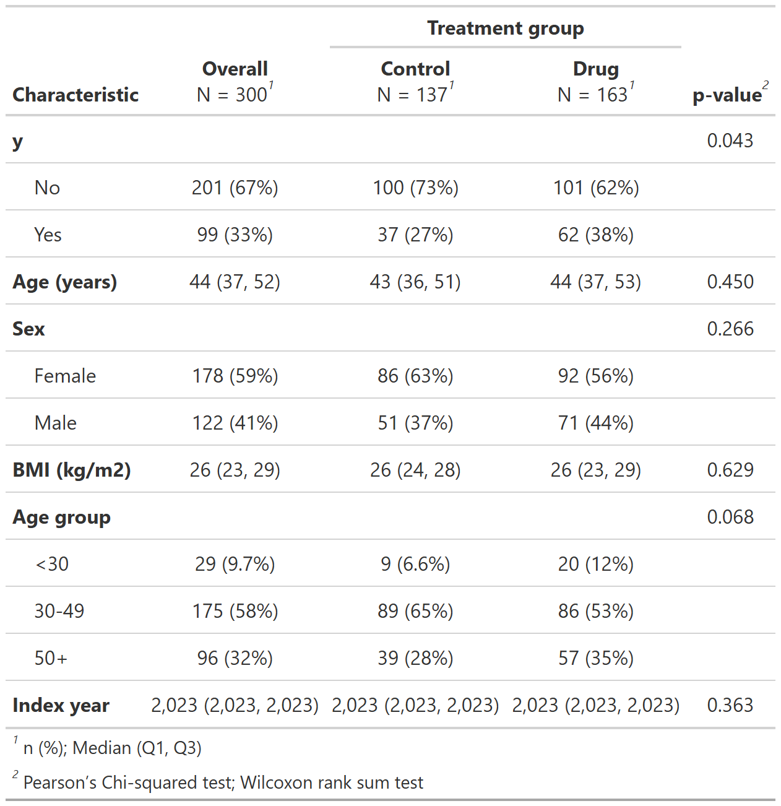
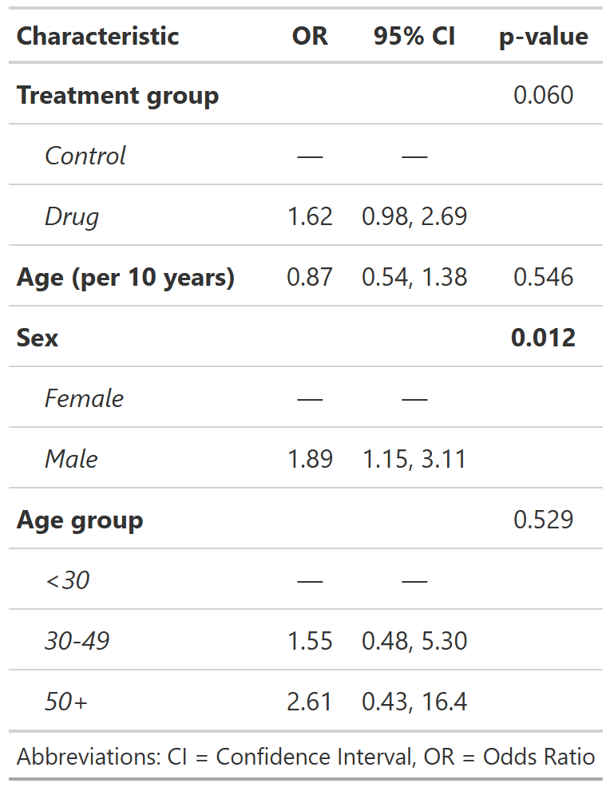

# Overview

-   Share a **minimal, reproducible R workflow** for small analyses.
    -   import --\> clean --\> decribe --\> model --\> report
-   Show a tidy folder structure with an **RStudio Project**.
-   Demo useful R packages, `here`, `tidyverse`, `table1`, and `gtsummary`

------------------------------------------------------------------------

# Folder structure

```
R-tips-for-EMBARC/
  data/  
    data/raw/     # raw data (read-only)
    data/clean/   # processed data
  analysis/       # analysis scripts
  results/        # tables/result files
    results/temp/ # intermediate results (will be deleted)
  figures/        # figures
  reports/        # reports (.qmd)
  references/     # references/reading materials
  README.md       # read me file
  R-tips-for-EMBARC.Rproj # open this in RStudio
```

------------------------------------------------------------------------

# Key Packages

| Stage    | Package(s)                 | Purpose            |
|----------|----------------------------|--------------------|
| Import   | here, readr, readxl, haven | path & Data I/O    |
| Clean    | dplyr, janitor, tidyverse  | Data cleaning      |
| Describe | table1, gtsummar           | Descriptive tables |
| Model    | gtsummary, tbl_regression  | Tidy model results |

------------------------------------------------------------------------

# Analysis steps

## Step 0 — Install and Load all dependency packages

**Tip:** Always open the `.Rproj` before running any script.

-   *analysis/00_dependencies.R*

```{r, eval=FALSE}
# list all packages needed
pkgs <- c("here", "tidyverse", "readr", "dplyr", "janitor", "lubridate",
          "stringr", "forcats", "table1", "gtsummary", "gt", "skimr",
          "ggplot2", "patchwork", "broom", "modelsummary", "survival",
          "survminer", "htmlwidgets", "webshot2", "broom.helpers"
   )

# Install any that are missing
install.packages(setdiff(pkgs, rownames(installed.packages())))

# Load them all
lapply(pkgs, library, character.only = TRUE)
```


------------------------------------------------------------------------

## Step 1 — Import and Clean the data

-   *analysis/01_data_process.R*

```{r, eval=FALSE}
#---- 1. source the dependencies file ----
source(here("analysis","00_dependencies.R"))
rm(list=ls())

#----2. Import the raw data ----
raw <- read_csv(here("data","raw", "study.csv"), show_col_types = TRUE)
#names(raw)
#glimpse(raw)

#----3. Clean the data ----

clean <- raw %>% 
  clean_names() %>% 
  mutate(
    age_grp = case_when(
      age < 30 ~ "<30",
      age < 50 ~ "30-49",
      TRUE ~ "50+"
    ),
    index_yr = year(index_date),
    y=factor(y, levels=c(0,1), labels=c("No", "Yes"))
  )

#----4. Save the clean data ----
readr::write_csv(clean, here("data","clean","study_clean.csv"))
saveRDS(clean, here("data","clean","study_clean.rds"))
```

------------------------------------------------------------------------

**Other common readers**:

-   CSV: `readr::read_csv()`, `data.table::fread()`
-   Excel: `readxl::read_excel()`
-   SAS/Stata/SPSS: `haven`

## Step 2 — Describe the data

+ Descriptive Tables that Look Good

  + `table1`: quick baseline tables.
  + `gtsummary`: clinical-style summaries, stratified, presentation-ready

---

-   *analysis/02_describe.R*

```{r, eval=FALSE}
#---- 1. source the dependencies file ----
library(here)
source(here("analysis","00_dependencies.R"))
rm(list=ls())

#---- 2. import the clean data ----
dat <- read_csv(here("data","clean", "study_clean.csv"), show_col_types = TRUE)

# or run this
dat <- readRDS(here("data","clean","study_clean.rds"))

#---- 3. assign labels/units ----
label(dat$age) <- "Age (years)"
label(dat$bmi) <- "BMI (kg/m2)"
label(dat$sex) <- "Sex"
label(dat$age_grp) <- "Age group"
label(dat$index_yr) <- "Index year"
label(dat$treatment) <- "Treatment group"
label(dat$y) <- "Outcome"

#---- 4. pre-define the format ----
render.cont <- function(x){
  with(stats.default(x),
       c("","Median (Q1, Q3)"=sprintf("%s (%s, %s)", round_pad(MEDIAN,0), 
                                      round_pad(Q1,0),
                                      round_pad(Q3,0))))
}
#---- 5. make the descriptive table ---- 

#==== 5.1 using table1 ====
table1 <- table1(~ y + age + sex + bmi + age_grp + index_yr
                 |treatment,
                 overall=c(left='Total'),
                 render.continuous=render.cont,
                 data=dat)
table1
#table1 <- as.data.frame(table1)
#write.csv(table1 , here("results","temp","summary_table1.csv"))

#==== 5.2 using gtsummary ====
sum_tab <- dat %>% 
  tbl_summary(
    include = c(y, age, sex, bmi, age_grp, index_yr, treatment),
    by = treatment,
    type=list(index_yr ~ "continuous",
              y ~ "categorical"),
    digits    = all_continuous() ~ 0) %>%
  add_p(pvalue_fun = label_style_pvalue(digits = 3)) %>% 
  add_overall() %>% 
  modify_spanning_header(c("stat_1", "stat_2") ~ "**Treatment group**") %>% 
  bold_labels() %>% 
  as_gt()

sum_tab 
#gt::gtsave(sum_tab, here("figures","table.png"))
```

------------------------------------------------------------------------

**The output descriptive table generating by `gtsummary`**

clean, professional formatting that aligns with journal standards

{width=70% fig-align="center"}
---

## Step 3 — Fit model

- *analysis/03_model.R*

```{r, eval=FALSE}
#---- 1. source the dependencies file ----
library(here)
source(here("analysis","00_dependencies.R"))
rm(list=ls())

#---- 2. import the clean data ----
dat <- read_csv(here("data","clean", "study_clean.csv"), show_col_types = TRUE)

# or run this
dat <- readRDS(here("data","clean","study_clean.rds"))

#---- 3. fit a logistic regression ---
fit_glm <- glm(y ~ treatment + I(age/10) + sex + age_grp, data = dat, family = binomial())
summary(fit_glm)

#---- 4. display the model results
mod <- fit_glm %>% tbl_regression(exponentiate = TRUE,
                     pvalue_fun = label_style_pvalue(digits = 3),
                     label = list(treatment ~ "Treatment group", 
                                  'I(age/10)' ~ "Age (per 10 years)",
                                  sex ~ "Sex",
                                  age_grp ~ "Age group") ) %>% 
  add_global_p() %>% 
  bold_p(t = 0.05) %>% 
  bold_labels() |>
  italicize_levels() %>% 
  as_gt

mod
#gt::gtsave(mod, here("figures","model.png"))

```

---

**Output:** nicely formatted table ready for publication

{width=70% fig-align="center"}

---

# Summary of workflow

+ Create a R project
+ Build a tidy folder structure

```
data/  # raw and clean data
analysis/       # analysis scripts
results/        # tables/result files
figures/        # figures
reports/        # reports (.qmd)
references/     # references/reading materials
README.md       # read me file
R-tips-for-EMBARC.Rproj # open this in RStudio
```
+ Analyse the data in efficient and reproducible order
```
 analysis/00_dependencies.R - install/load packages
 analysis/01_data_process.R - import and clean the raw data
 analysis/02_describe.R - descriptive analysis
 analysis/03_model.R - fit the models
```
---

# Takeaways

✔️ Use **R project + `here`** --> robust paths and reproducibility

✔️ **`gtsummary`** --> publication-quality descriptive and model tables

✔️ Keep scripts modular & outputs organized

---

# Thank you

Slides & demo files:
👉 GitHub: [QianYe-stat/R-tips-for-EMBARC](https://github.com/QianYe-stat/R-tips-for-EMBARC.git)

Let's open RStudio and walk through!
